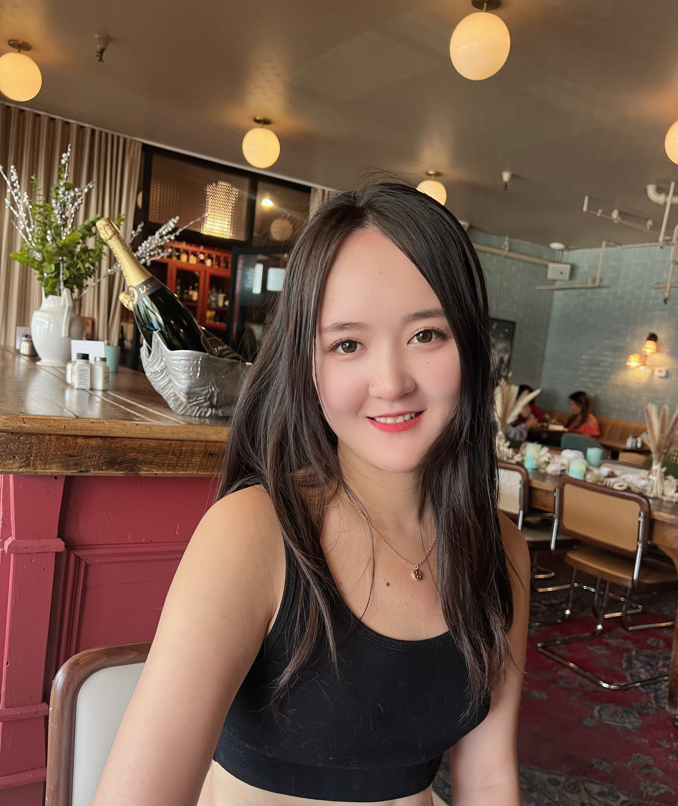
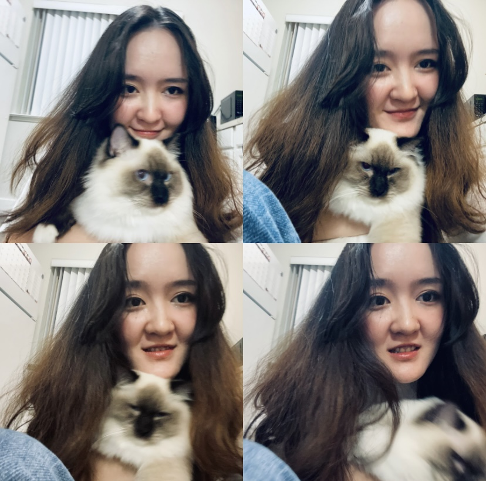

# Welcome to Xinyao's Github 😊 

Hi, I'm Xinyao, a proactive Gemini with the ISFP personality type. I'm intensely curious about fresh and challenging endeavors. I love keeping up with the latest technological advancements, and I pride myself on my strong ability to act upon and replicate them. My planning preference leans towards setting short-term goals for the next three days and long-term visions spanning five years. I cherish the dynamic nature of plans as they progress and am passionate about harnessing my creativity to guide new directions in planning.

Lately, I've been engrossed in Kaggle competitions. I've participated in three projects so far: ICR, LLM, and CAFA. Concurrently, I'm diving deep into advanced solutions from past projects and honing my predictive techniques. Two of them are Ubiquant prediction and AI Games.

In 2020, I graduated from Columbia University with a Master's in Biostatistics. Pinned on my homepage are the projects I undertook during my MS, many of which relate to healthcare. My primary focus at Columbia was on theory and decision-making, encompassing fundamental knowledge in computational statistics like data mining, optimization, and more. My thesis centered on causal inference, an intriguing direction in statistics that extends well into the realm of Machine Learning.

I'll keep updating my GitHub with new projects. Stay tuned!

# 🔭 My Kaggle Competition Adventure

### [Kaggle - LLM Science Exam](https://github.com/Xinyao0118/LLM_Science_Exam/tree/main)

Built and evaluated a Large Language Model using a pre-trained BERT model for answering science questions, achieving a 0.6 MAP.

[pipeline](https://xinyao0118.github.io/2023/07/22/restructure-llm-hugging-face-version/)

### [ICR - Identifying Age-Related Conditions](https://www.kaggle.com/competitions/icr-identify-age-related-conditions)
Initially, I utilized LightGBM with Optuna for hyperparameter tuning, running 100 trials. Post-analysis of the feature importance plot led me to limit the feature list and ensemble five LightGBM models. The cross-validation displayed an impressive AUC of 0.99, yet the leaderboard (LB) score wasn't as good as expected (0.22).

Recognizing this, I delved into diagnosing the issue and improving the model. I discovered:

- The task was disease detection, thereby making recall a priority over AUC.
- The training data size was small (<700 rows), increasing the risk of overfitting with LightGBM or Neural Networks.
- The data was imbalanced with less than 200 positive instances, which was only 17% of the total.

In light of these insights, I initiated several improvements:

- Applied KNN Imputer for missing value treatment.
- Utilized Synthetic Minority Over-sampling Technique (SMOTE) to balance the positive and negative instances.
- Shifted my ensemble strategy from averaging 5 LightGBM models to a voting system encompassing logistic regression, random forest, and SVM models.
- Changed the cross-validation metric from AUC to recall.

The new verson's LB score is waiting for calculation...

### [CAFA-5 Protain Function Prediction](https://www.kaggle.com/competitions/cafa-5-protein-function-prediction)

In progress

# 🛠️ Technologies & Tools

### Programming: 
Python, SQL, R, Spark, Git, Bazel, Airflow, AWS, MLFlow, Databricks, CICD, Snowflake, Docker, Jupyter, Pytorch, Tensorflow, MySQL, MangoDB

### Statistics & Data Mining: 

A/B Testing, ANOVA, LLM, NLP, Deep Learning, Hyperparameter tuning (Optuna), Supervised Learning (LightGBM), Unsupervised Learning, Data Mining (Quantitive prediction)
Industries I've Worked In: Tech, Advertisement (Audience prediction), E-commerce (funds flow forecasting, fraudulent activities detection), Healthcare (cancer detection, medical text classification, insurance beneficiaries risk adjustment)

# 🌱 My Journey So Far
### VideoAmp, CA
As a Machine Learning Engineer, I led the design and development of personification systems, optimized data warehousing, implemented viewership prediction models, and facilitated extensive feature engineering.

### Acumen, CA

As a Data Engineer, I optimized data pipelines for large datasets, automated manual tasks, integrated validation processes, and investigated data anomalies.

# ⚡ A Glimpse into My Projects

- [Multilingual Toxic Comment Classification](https://xinyao0118.github.io/2021/07/22/twitter-comments/): Developed an RNN model using Keras tokenizer, GloVe vectors, and LSTM, achieving an AUC of 0.97 for detecting toxic comments.
- [Funds Inflow Prediction (2014) for Ants Financial Services Group](https://xinyao0118.github.io/2019/03/21/Funds-Inflow-Prediction/): Improved funds management efficiency by 12% by predicting daily purchase trends using time series analysis with ARIMA.
- [Fraud Credit Card Transaction Detection](https://xinyao0118.github.io/2020/06/22/Credit-Card-Fraud-Detection/): Protected $450k by identifying 1.85% of suspected transactions through clustering and PCA, proved the significant difference by Mann Whitney U Test.
- [Fraudulent Activities Detection](https://xinyao0118.github.io/2021/04/28/Identifying-Fraudulent-Activities/): Protected $93k from fraud in an E-commerce site by identifying fraudulent activities using Random Forest on 8 months transaction data.

# 💡A Glance into My Articles
- [The Evolution of Data Storage](https://medium.com/@wuxinyao1996/the-evolution-of-data-storage-comparing-data-warehousing-data-lakes-and-data-lakehouses-f4d62af75cb3): Data Warehousing, Data Lake, and Data Lakehouse

[Alternative link if you don't have access to Medium](https://xinyao0118.github.io/2023/07/17/DL_DW_DLH/)

This article is inspired by a post written by a Databricks engineer. It is aimed at company engineers who use the Databricks ecosystem but are unclear about why they chose it or its advantages. With this piece, we hope to demystify the underlying concepts and benefits of Databricks, specifically in comparison to Data Warehouses and Data Lakes.

- [Unleashing the Power of LLMs: Revolutionizing Natural Language with Advanced AI Models](https://medium.com/@wuxinyao1996/unleashing-the-power-of-llms-revolutionizing-natural-language-with-advanced-ai-models-1cf5b6afeea4)

[Alternative link if you don't have access to Medium](https://xinyao0118.github.io/2023/07/09/LLM/)

A Large Language Model (LLM) refers to a type of artificial intelligence model designed to understand and generate human-like text. These models are trained on vast amounts of text data and utilize deep learning techniques, typically based on neural networks, to generate coherent and contextually relevant responses to textual prompts.

# 📫 How to reach me

### [Portfolio 🌕](https://xinyao0118.github.io/)

### [LinkedIn ✨](https://www.linkedin.com/in/xinyao-wu/)

### [Email 📧](mailto:wuxinyao1996@gmail.com)

# 😎Fun Fact
### Welcome our fluffy friend --> 🐱 Severus  🐱

Severus is my speakless friend, he is a 2 years old male ragdoll. He loves running around the house after pooping.

### My another friend --> 🎻 Violin 🎻
I was a second violinist in Columbia University Irving Medical Center Symphony Orchestra.

Once a rehearsal we switched the conductor, the old one became my partner and sat next to me.

Then he finally knew I was the one who played out of tune.

<!--
**Xinyao0118/xinyao0118** is a ✨ _special_ ✨ repository because its `README.md` (this file) appears on your GitHub profile.

Here are some ideas to get you started:

- 🔭 I’m currently working on ...
- 🌱 I’m currently learning ...
- 👯 I’m looking to collaborate on ...
- 🤔 I’m looking for help with ...
- 💬 Ask me about ...
- 📫 How to reach me: ...
- 😄 Pronouns: ...
- ⚡ Fun fact: ...
-->
